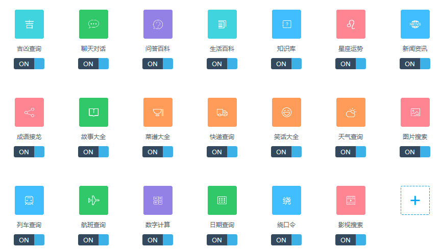

#smart QQ聊天机器人

---

## 出现103错误的解决方案：
由于API的不稳定性，如果扫码登录后控制台出现频繁大量的文本，这时应当关闭程序，查看日志（logs目录）
如果有`{"errmsg":"error!!!","retcode":103}`这样的字段，需要进入http://w.qq.com/
在QQ官网上扫码登录，然后退出登录，再试（需要多试几次）
另外，这里还有一个[api](https://github.com/xcr1234/smartqq)，似乎更稳定（有时也可能出现103错误）？但功能没这个齐全，我正在考虑将这两个api合并。

---

主要功能：
开启后扫描二维码登录QQ，您的QQ消息将被图灵机器人接管（限好友消息），支持以下功能；



---

##运行：
配置好Java环境变量，  
进入bin目录运行start.bat。  

    
##通过Maven编译

配置好maven，运行com.qq.Program主类。

命令为：

```
mvn clean compile exec:java -Dexec.mainClass="com.qq.Program"    
```

如果maven执行失败，可以尝试修改pom.xml，将repositories中的
```xml
<repository>
            <id>webqq-core github</id>
            <url>https://raw.githubusercontent.com/xcr1234/webqq-core/master/mvn-repo-snapshot</url>
</repository>
```
改为
```xml
<repository>
    <id>webqq-core coding</id>
    <url>https://coding.net/u/xcr_abcd/p/webqq-core/git/raw/master/mvn-repo-snapshot</url>
</repository>
```

---

**该项目仅供学习交流使用！**

---

技术参考：

https://github.com/xcr1234/webqq-core

http://www.tuling123.com/


